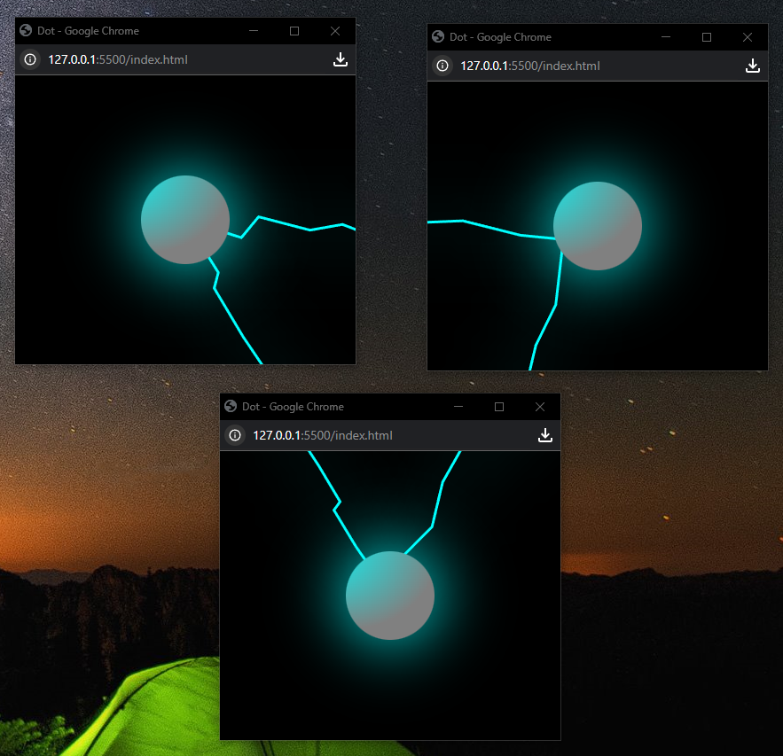
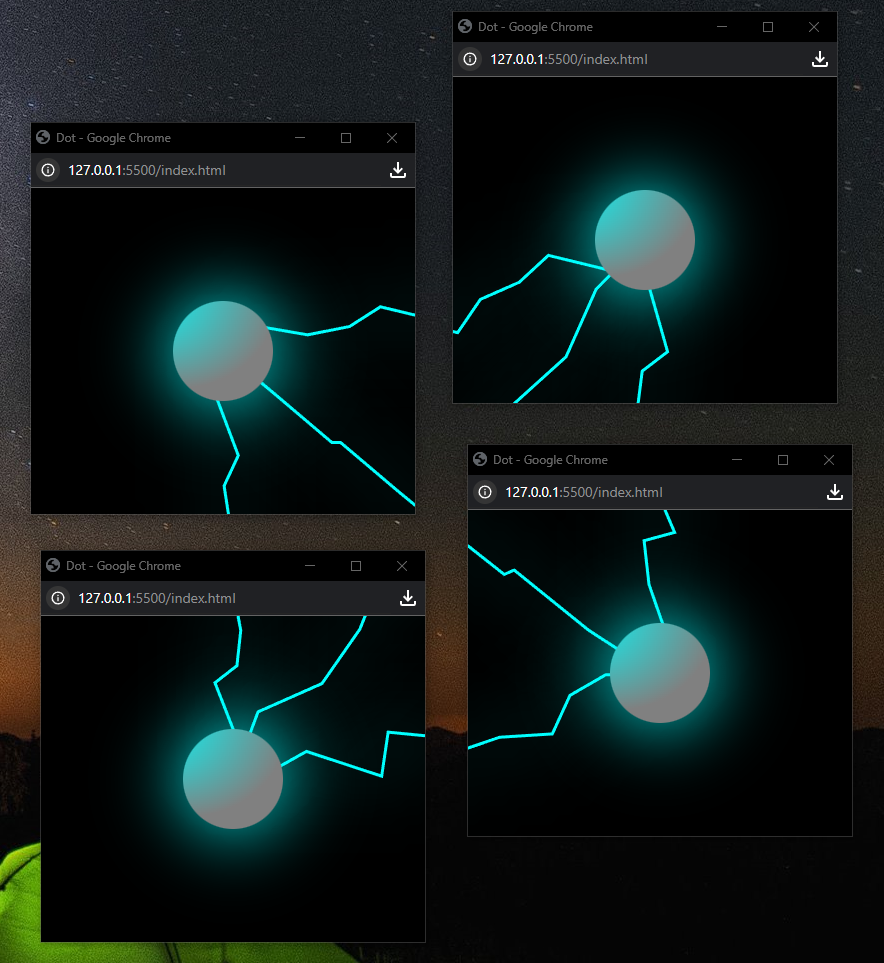

# 🔵⚡🔵 ConnectionOfPoints
## 🚀About the Project
**Connection of points** - this project creted in education porposes.👨‍🎓

Idea this project draw **n** quantity dots in individual windows and show global conection between them.
And target demonstration interaction by using tehnology **Web-Socket**.
<p align="center">
  
  
</p>

---

## 📦 Technologies
- **HTML5 Canvas** - render graphics 
- **JavaScript** - logic draw graphics and 
- **Web-Socket** - data exchange between windows
- **CSS3** — stage design
  
  ---
  
## 🛠️ Installation and Run Project
```bash
# Clone the repository
git clone [https://github.com/NickYeromin/Interactive-Solar-System.git](https://github.com/NickYeromin/ConnectionOfPoints.git)

# Download npm WebSocket server
npm init -y
npm install ws

# Run project server
node server.js

# Run first window project (for pre installed Live-Server)
# -next window open clicked in dot (works for all windows conection project)
live-server index.html
